C#으로 게임 서버 만들기 - 1. 네트워크 기반 코드 작성
============
출처  http://lab.gamecodi.com/board/zboard.php?id=GAMECODILAB_Lecture_series&page=2&sn1=&divpage=1&sn=off&ss=on&sc=on&select_arrange=headnum&desc=asc&no=62
 

# 네트워크 기본 모듈 작성
네트워크 통신을 하기 위한 기반 코드를 작성해 보겠습니다.
강좌 목표에 집중하기 위해서 이 강좌에서는 TCP 소켓만 지원하겠습니다.

CNetworkService 클래스에 네트워크 통신에 필요한 기반이 될 코드들을 넣어볼 것입니다.
일단 멤버 변수들 부터 알아보자

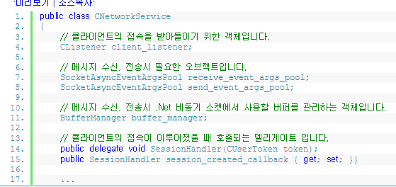

클라이언트의 접속을 받아들이는 Listener객체가 선언되어 있습니다.
소켈 프로그래밍을 배워보신 분이라면 bine -> listen -> accept 순서를 알고 계실겁니다.
.Net이 최신 기술이긴 하지만 TCP와 관련된 부분은 옛부터 내려오고 있는 흐름을 거의 그대로 따라갑니다.
다른 언어로 구현한다고 해도 이 부분은 크게 변하지 않죠.

그 다음줄을 보면 생소한 객체가 보일겁니다.
SocketAsyncEventArgs라는 클래스는 .Net비동시 소켓에서 사용하는 개념으로
비동기 소켓 매소드를 호출할 때 항상 필요한 객체입니다.
이전에 사용하던 Begin~End 계열의 API를 슬 때보다 더 발전된 부분이라고 하는데요.
매번 IAsyncResult를 생성하지 않고 저렇게 풀링하여 사용할 수 있기 때문에 메모리 재사용이 가능한 것이 장점입니다.
MSDN의 문서중세는 객체를 풀링하여 쓰는것이 기존 native c++ 에서 하는 풀링만큼의 효율을 가져오지 않을 수 있다고 나와 있습니다.

하지만 저는 풀링하여 쓰는 쪽을 선택했습니다.
어차피 서버가 살아있는 동안에는 계속 사용할 메모리이기 때문에 풀링하는게 낫겠다 싶었습니다.

그 다음줄에 BufferManager가 있습니다.
이름에서도 알 수 있듯이 데이터 송, 수신할 때 사용할 버퍼를 관리하는 매니저 객체 입니다.
소켓에 관련된 책을 보면 송, 수신 버퍼라는 얘기를 자주 듣게 됩니다.
TCP에서 데이터를 보내고 받을 때 소켓마다 버퍼라는 것이 할당됩니다.
이건 OS딴에서 구현되어 있는 부분이라 우리가 신경 쓸 필요는 없습니다.
우리는 이 소켓 버퍼로부터 메시지를 복사해 오고(수신) 밀어넣는 (전송) 작업을 할 때 사용할 버퍼를 설정해주면 됩니다.
이 버퍼 역시 네트워크 통신이 지속되는 동안에 계속해서 사용하는 메모리가 되겠습니다.
따라서 이것도 풀링하여 메모리를 재사용 할 수 있도록 해야겠죠...

Net환경에서는 가비지 컬렉션이 작동되므로 꼭 풀링하지 않아도 되지만,
버퍼라는건 거의 매순간 쓰인다고 봐도되니 그냥 풀링하기로 합시다.

그 다음에는 델리게이트가 정의되어 있는데 클라이언트가 접속했을 때 어딘가로 통보해주기 위한 수단입니다.

# 클라이언트의 접속 처리하기
이제 클라이언트의 접속을 처리하기 위한 코드를 작성해 보겠습니다.
위에서 말씀드렸듯이 TCP 서버 구현의 흐름은 bine -> listen ->accept 순으로 진행됩니다.

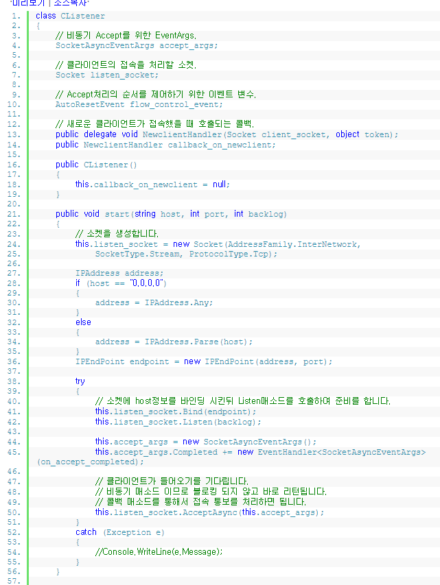

Listen처리 코드의 일부분 입니다. 
CListener라는 클래스는 선언하였습니다. 앞서 보여드린
CNetworkService 클래스에 통합하지 않고 코드를 따로 분리하였는데,
그 이유는 Listener를 여러개 두는 구조로 설계하였기 때문입니다.
경우에 따라서 클라이언트의 접속을 받아들이는 Listener,
서버간 통신을 위해서 다른 서버의 접속을 받아들이는 Listener등 여러개의 Listener가 존재할 수 있습니다.
이런 부분을 대비하기 위해서 위와 같이 분리된 구조를 채택한 것입니다.

> 하나의 클래스에 여러가지 기능을 다 넣어도 상관없지만 코딩하다 보면 분리할 필요성을 느낄 때가 있습니다.
처음 작성을 시작했을 때 CNetworkService 클래스에 Listen코드까지 포함되어 있었습니다.
하지만 여러가지 테스트를 해보고 다른 사람이 작성한 코드도 살펴보니 대부분 분리되어 있더군요.

IPEndPoint 라는 객체는 끝점이라고 말할 수 있는데 도착지점으로 이해하시면 됩니다.
클라이언트가 도착할 지점은 서버가 됩니다. 서버의 IP,Port정보로 IPEndPoint가 구성됩니다.
이 서버가 Host가 되며 클라이언트는 Peer라고 말할 수 있습니다.

그 다음 줄은 bind -> listen 순으로 진행됩니다.
소켓 프로그래밍 책에서 많이 보셨을 겁니다. 서버 정보를 소켓에 bind시키고 listen을 호출하여 준비작업을 마칩니다.

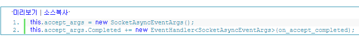
드디어 SocketAsyncEventArgs라는 객체를 사용할 때가 왔습니다.
Completed 프로퍼티에 이벤트 핸들러 객체를 연결시켜 주고 AcceptAsync 호출시 파라미터로 넘겨주기만 하면 됩니다.
Completed 라는 이름에서 알 수 있듯이 accept처리가 완료되었을 때 호출되는 델리게이트 입니다.
.Net 비동기 소켓에서는 이처럼 매소드 호출 -> 완료 통지 개념으로 이루어 집니다.
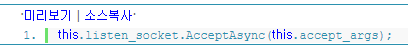

이제는 accept 처리 부분입니다. 이 강좌에서는 비동기 매소드를 사용하기로 하였으므로
AcceptAsync를 호출합니다. 이 매소드는 호출한 직후 바로 리턴되며 accept결과에 대해서는 콜백 매소드로 통보가 옵니다.
따라서 프로그램이 블로킹 되지 않고 통보를 기다리며 다른 일을 할 수 있게 되죠.

AcceptAsync까지 호출하면 클라이언트의 접속을 받아들일 수 있는 상태가 됩니다.
간단하지만 방금 우리는 서버를 하나 만들었습ㄴ디ㅏ.

# 스레드를 통한 Accept 처리
위에서 AcceptAsync호출 부분을 스레드를 통해서 처리하도록 바꿔볼 것입니다.
꼭 스레드를 통하지 않고도 accept 처리는 가능합니다.
하지만 특정 OS버전에서 콘솔 입력이 대기중일 때 accept처리가 안된다는 버그가 있다는 문서를 발견한 적이 있습니다.
(http://stackoverflow.com/questions/12464185/windows-8-net-tcp-acceptasync-callback-not-firing-blocked-by-console-readlin)
메인 스레드가 입력을 위해 대기 상태에 있다고 하더라도 accept처리를 별도의 스레드에서 돌아가도록 구성 한다면
위 문제를 회피할 수 있을 것이므로 이렇게 구현하려고 하는 것입니다.
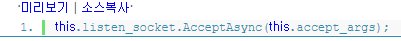
이 부분을 아래 처럼 바꿔보겠습니다.
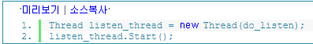
스레드를 생성하고 do_listen이라는 매소드를 스레드에서 처리하도록 합니다.
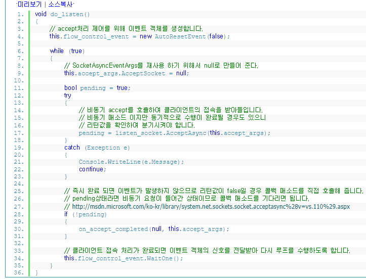

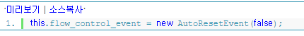

스레드 시작 부분에는 이벤트 객체를 생성하는 코드가 있습니다.
하나의 접속 처리가 완료된 이후 그 다음 접속 처리를 수행하기 위해서 스레드의 흐름을 제어할 필요가 있는데,
그 때 사용되는 이벤트 객체입니다.,

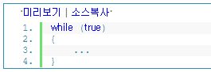

루프를 돌며 클라이언트의 접속을 받아들입니다.

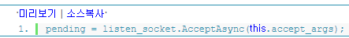
AcceptAsync의 리턴값에 따라 즉시 완료처리할 것인지
통보가 오기를 기다릴 것인지 구분해 줘야합니다.

accept처리가 동기적으로 수행이 완료될 경우 콜백매소드가 호출되지 않고 false를 리턴합니다.
따라서 이 경우에는 완료처리를 담당하는 매소드를 직접 호출해줘야합니다.
그 외 경우 (true 리턴) .net에서 콜백 매소드를 호출해주기 때문에 직접 호출할 필요가 없습니다.
아마 대부분 후자의 경우가 발생하지 않을까 하네요.

> Net비동기 매소드를 호출할 때 주의할 점은 즉시 완료될 경우와
그렇지 않은 경우가 있다는 것입니다. 매소드의 리턴값이 true/false중 어느것으로 나오는가에 따라서 구분해주면 됩니다.

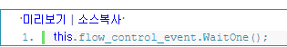
AcceptAsync를 통해서 하나의 클라이언트가 접속되기를 기다린 후 이벤트 객체를 이용해서 스레드를 잠시 대기 상태로 둡니다.

> 이벤트 객체에 대해서 잘 모르시는 분들은 인터넷에 자료 많으니 읽어보시길 바랍니다.
이벤트 객체의 종류에는 두가지 있는데, AutoResetEvent는 한번 Set이 된 이후 자동으로 Reset상태로 만들어주며,
ManualResetEvent는 직접 Reset매소드를 호출하지 않는 한 계속 Set 상태로 남아있습니다.
상황에 맞게 골라쓰면됩니다.

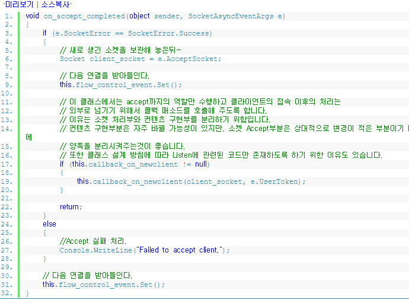

AcceptAsync 호출 결과를 통보받을 매소드를 구현해 봤습니다.
파라미터로 넘어온 값을 비교하여 성공, 실패에 대한 처리를 구현해 주면 됩니다.
성공했을 경우 자동으로 소켓이 하나 생성되는데, 이 소켓을 잘 보관해 놓았다가
클라이언트와 통신할 때 사용하도록 합니다.
그리고 콜백 매소드를 호출하여 성공했음을 알려준 뒤
또 다른 연결을 받아들이기 위해서 이벤트 객체를 Set상태로 만들어 줍니다.
코드 흐름을 따라가 보면 잠시 대기해 있던 스레드가 진행되면서 다시 AcceptAsync 매소드를 호출하게 됩니다.
이렇게 하나의 접속을 처리하고 다음 접속을 처리하기 위해 무한 루프를 돌며 accept를 수행하는 방식으로 구현되어 있습니다.

> 하나의 스레드에서 순차적으로 accept를 처리하는 구현 방식과 여러 스레드에서 동시에 처리하는 구현 방식 중
어느 방식이 더 성능이 좋은가 하는 부분은 저도 확실히 테스트하지 못했습니다.
따라서 이 강좌에서는 하나의 accept완료한 뒤 다음 accept 처리하는 순차적인 방식으로 설명하였습니다.

