C#으로 게임 서버 만들기 - 2. 접속 처리 및 버퍼 풀링 기법
============

## 접속 이후의 처리
CNetworkservice 세부 구현 내용
Accept 처리가 완료되었을 때 on_new_client 델리게이트를 호출해주는 부분까지가 CListener 클래스의 역할이었습니다.
이제 CNetworkService 클래스에 대해서 좀 더 자세히 들어가보도록 하겠습니다.
앞서 설명 드린 대로 CNetworkService 클래스에는 네트워크 기반이 되는 코드가 들어가게 됩니다.
대표 적인 기능은 다음과 같습니다.

> - CListener를 생성하여 클라이언트의 접속을 처리
> - SocketAsyncEventArgs객체를 풀링하여 재사용 가능하도록 구현
> - 메시지 송수신 버퍼를 풀링하는 매니저 클래스 구현 

###Listen 처리

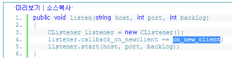

listen 생성 부분 입니다.
서버의 host, port , backlog값을 전달 받아 listener를 생성한 뒤 start 매소드로 접속을 기다립니다.

###SocketAsyncEventArgs 풀링 구현
소켓별로 두개의 SocketAsyncEventArgs가 필요합니다.
하나는 전송용, 다른 하나는 수신용 입니다.
그리고 SocketAsyncEventArgs 마다 버퍼를 필요로 하는데 결국 하나의 소켓에 전송용 버퍼 한개, 수신용 버퍼 한개
총 두개의 버퍼가 필요하게 됩니다.
먼저 SocketAsyncEventArgs를 어떻게 풀링하여 사용하는지 알아보겠습니다.

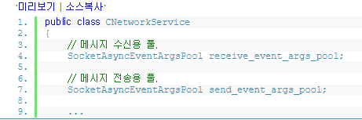

전송용 , 수신용 풀 객체를 각각 선언합니다.
풀링에 사용되는 클래스는 SocketAsyncEventArgsPool입니다.
이 코드는 msdn에 있는 샘플 코드를 그대로 가져 왔습니다.

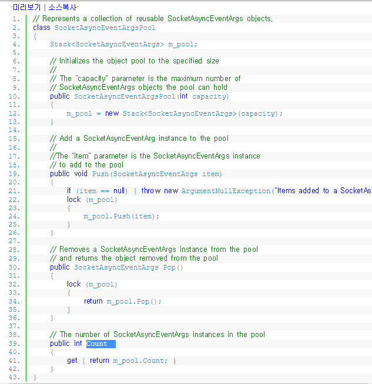

코드 자체는 굉장히 간단합니다.
객체를 담을 수 있는 Stack을 생성하여 Pop / Push매소드를 통해서 꺼내오고 반환하는 작업을 수행합니다.

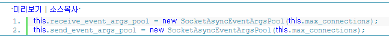

최대 동접 수치 만큼 생성합니다.

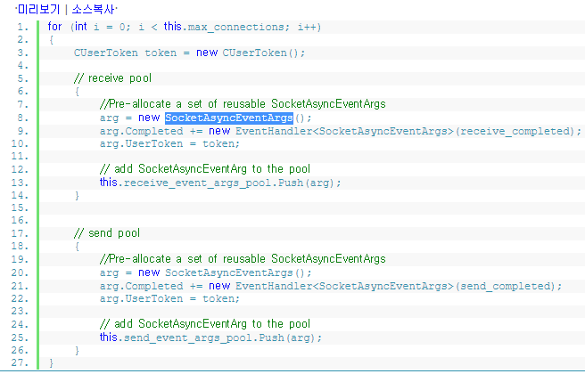

설정해놓은 최대 동접 수치만큼 SocketAsyncEventArgs 객체를 미리 생성하여 풀에 넣어놓는 코드 입니다.
간단한 로직이라 더 설명할 필요가 없을듯 하네요.

### 송, 수신 버퍼 풀링 기법
BufferManager
다음으로 버퍼 관리에 대한 구현을 보겠습니다.
SocketAsyncEventArgs마다 버퍼가 하나씩 필요하다고 설명드렸습니다.
이 버퍼라는 것은 바이트 배열로 이루어진 메모리 덩어리입니다.

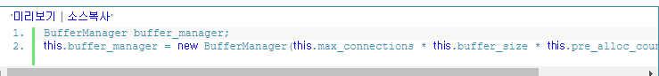

버퍼 매니저를 선언하고 생성하는 코드 입니다.

버퍼의 전체 크기는 아래 공식으로 계산됩니다.
버퍼의 전체 크기 = 최대 동접 수치 * 버퍼 하나의 크기 * (전송 , 수신용)

전송용 한개 , 수신용 한개 총 두개가 필요하기 때문에 pre_alloc_count = 2 로 설정해 놨습니다.
그럼 이제 버퍼 매니저의 코드를 살펴보겠습니다.

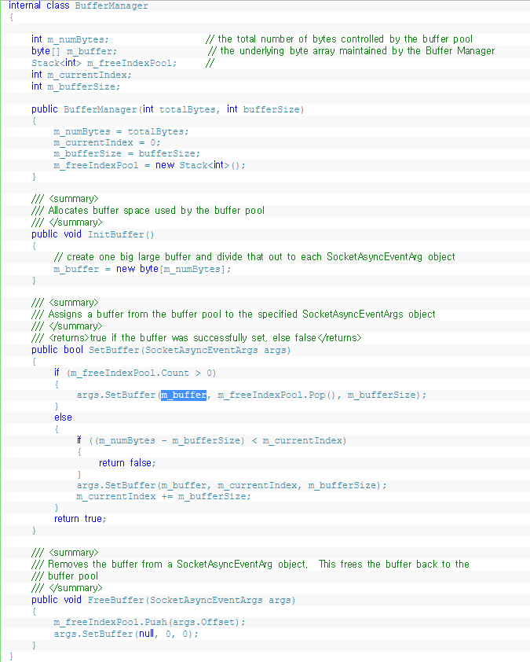

이 코드도 msdn에 있는 샘플을 가져온 것입니다.
InitBuffer 매소드에서 하나의 거대한 바이트 배열을 생성합니다.
그리고 SetBuffer(SocketAsyncEventArgs args) 매소드에서 SocketAsyncEventArgs객체에 버퍼를 설정해 줍니다.
하나의 버퍼를 설정한 다음 index값을 증가시켜 다음 버퍼 위치를 가리킬 수 있도록 처리합니다.
넓은 땅에 금을 그어서 이건 내꺼, 저건 니꺼 하는 식으로 나눈다고 생각하면 되겠네요.
마지막에는 사용하지 않는 버퍼를 반환시키기 위한 FreeBuffer매소드가 보입니다.
이 매소드는 아마 쓰이지 않게 될 것 같ㅅ습니다.
왜냐하면 프로그램 시작시 최대 동접 수치만큼 버퍼를 할당한 뒤 중간에 해제하지 않고 계속 물고있기 때문입니다.
SocketAsyncEventArgs 만 풀링하여 재사용할 수 있도록 처리해 놓으면 이 객체에 할당된 버퍼도 같이 따라가게 되니깐요.

이전에 SocketAsyncEventArgs를 생성하여 풀링처리 했던 부분을 다시 보겠습니다.

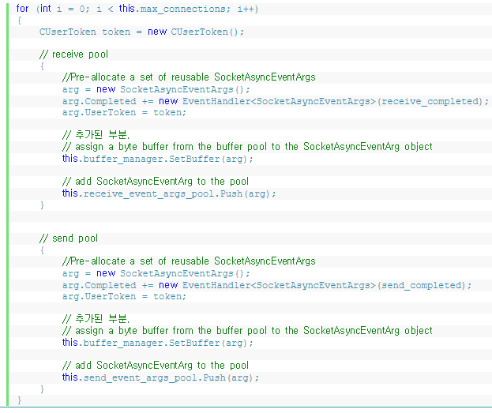

this.buffer_manager.SetBuffer(arg); 라는 코드가 보이나요??
이 부분이바로 socketAsyncEventArgs객체에 버퍼를 설정하는 코드 입니다.
SetBuffer내부를 보면 범위를 잡아서 arg.SetBuffer를 호출해주게끔 되어있죠./

m_currentIndex += m_bufferSize; // 이런식으로 버퍼 크기만큼 인덱스값을 늘려서 서로 겹치지 않게 해주고 있는겁니다.

다시 정리해 보면 하나의 거대한 버퍼를 만들고
버퍼 사이즈만큼 범위를 잡아 SocketAsyncEventArgs객체에 하나씩 설정해 줍니다.
이런 구현 방식으로 SocketAsyncEventArgs객체와 버퍼 메모리를 풀링하여 사용하게 됩니다.

첫번째 강좌에서도 말씀드렸듯이 닷넷에는 가비지 컬렉터가 작동되므로 풀링하지 않아도
객체 참조 관계만 잘 끊어주면 알아서 메모리를 정리해 줍니다.
저도 시험삼아 풀링하지 않고 필요할때 new하는 방식으로 돌려봤는데 메모리 사용량이 엄청나게 늘어나더군요.
가비지 컬렉터가 작동되는 시점이 우리가 만들 서버에 잘 들어맞는다는 보장은 없기에 저는 그냥 맘편하게 풀링하는 쪽을 선택했습니다.

### 유저의 접속 처리하기
SocketAsyncEventArgs와 버퍼 풀링까지 준비해 놨으면 이제 접속된 클라이언트를 처리할 준비가 완료된것입니다.
단순한 에코서버라면 이런 준비과정이 필요없을 수 있지만 수천의 동접을 처리하는 게임서버라면
조금 번거롭더라도 이런 작업들을 잘 만들어 놔야 합니다.
또한 만들어 놨다고 끝난것이 아니라 그때부터 시작일지도 모릅니다. 처음 설계한대로 이쁘게 코딩을 해놨어도 실제 테스트
해보면 부족한 부분이 보일때가 있기 때문이죠.
디버깅 하면서 뭔가 개운하지 못한 느낌이 든다면 설계를 다시 할 각오도 해야합니다.
(가끔 귀찮을 때는 땜질코딩으로 넘어가기도 하죠.^^)
클라이언트의 접속이 이루어진 후 호출되는 콜백 매소드인 on_new_client를 살펴보겠습니다.

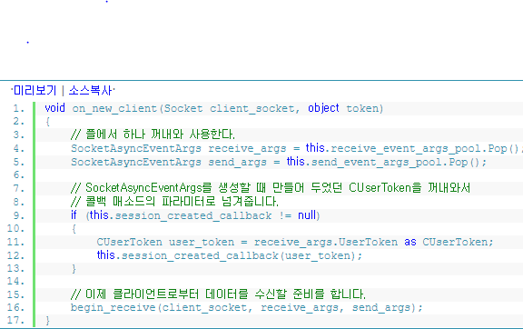

accept처리가 완료된 후 생성된 새로운 소켓을 파라미터로 넘겨주게 했습니다. 
앞으로 이 소켓으로 클라이언트와 메시지를 주고 받으면 됩니다.
풀링해 놨던 SokcetAsyncEventArgs객체도 드디어 사용할 때가 왔습니다.

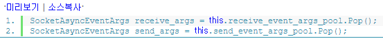

메시지 수신용, 전송용 각각 하나씩 꺼냅니다.

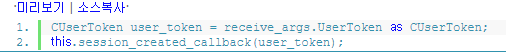

위에서 설명하진 않았지만 SocketAsyncEventArgs를 생성할 때 CUserToken이라는 클래스도 같이 생성하였습니다.
원격지 클라이언트 하나당 한개씩 매칭되는 유저객체라고 생각하면 됩니다.
SocketAsyncEventArgs의 UserToken변수에 참조하게끔 설정해놨었죠.

begin_receive (client_socket , receive_args,  send_args);

클라이언트가 접속한 이유는 무언가를 주고 받기 위함이니 이제 메시지 수신을 위한 작업을 시작합니다.
전송을 위한 작업은 서버에서 메시지를 보낼 시점에 일어나므로 아직 준비할 필요는 없습니다.

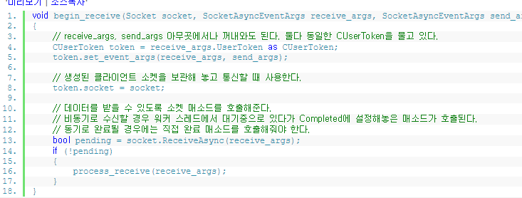

비동기 소켓 매소드는 사용법이 다 비슷합니다. xxxAsync매소드 호출 뒤 리턴값을 확인하여
콜백 매소드를 기다릴지 , 직접 완료 처리를 할지 결정해주는 부분은 이전 accept처리 부분과 흡사합니다.

먼저 CUserToken객체에 수신용, 전송용 SocketAsyncEventArgs를 설정해 줍니다.
메시지 송,수신시 항상 이 SocketAsyncEventArgs가 따라다니게 되기 떄문에 작업 편의를 위해서 CUserToken객체에도 설정해 주도록 하였습니다.

마지막으로 ReceiveAsync매소드를 호출해주면 해당 소켓으로부터 메시지를 수신받을 수 있게 됩니다.
비동기 매소드이니 리턴값을 확인해야겠죠??

> 강좌를 보시면서 이해가 잘 안되는 부분도 많을겁니다.
> 특히 CListener부터 SocketAsyncEventArgsPool, BufferManager , UserToken등등
> 많은 클래스들이 서로 관계를 맺도록 구조가 잡혀있는데 이런 시스템이 한번에 이해되긴 힘듭니다.
> 저도 처음 라이브러리를 설계할 때 모두 완성해놓고 코딩한것은 아닙니다.
> 하나의 클래스에서 단순하게 구현해본 뒤 점점 확장 / 분리할 필요성을 느끼게 되면서 다시 설계하여
리팩토링 하는 작업을 수십번 반복한 결과입니다.
따라서 처음에는 그냥 대충 이런 흐름이구나 하고 넘어가신뒤 직접 코딩해 보면서 다시 참고하는 방법을 권해드립니다.

다음은 ReceiveAsync이후에 콜백으로 호출되는 매소드입니다.

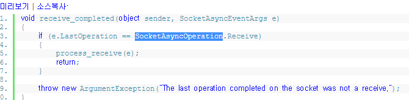

오류가 났을 때 예외를 던져주면 부분만 빼면 그냥 process_receive매소드를 호출해주는 것 밖에 없습니다.
사실 e.LastOperation이 Receive가 아닌 경우는 발생하지 않을 것 같습니다.
이 코드는 메시지 송, 수신 완료 처리를 하나의 콜백 매소드에서 분기하여 처리하려고 할 때 들어갔던 코드거든요

이제 process_receive 매소드를 보겠습니다.

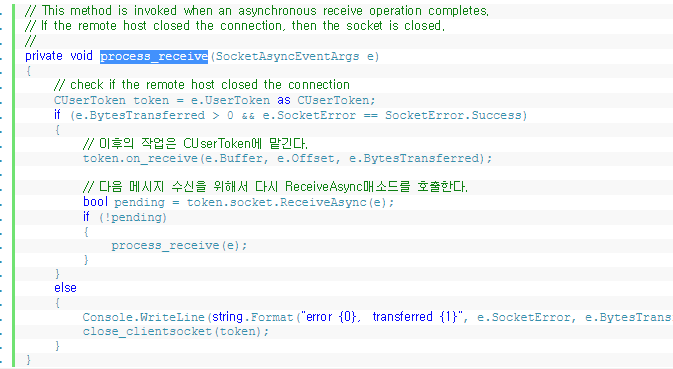

이제 SocketAsyncEventArgs라는 객체가 어느정도 눈에 익었을 겁니다. 이벤에도 역시 이 객체를 사용하게 되는데요. 
버퍼도 물고 있고, 유저 객체도 하나 갖고 있고 클라이언트 하나와 통신하는데 필요한 최소한의 재료들을 담고있는 녀석이라고 
생각하기로 합시다.

CUserToken을 얻어와서 on_receive매소드를 호출해 줍니다.
token.on_receive(e.Buffer , e.Offset , e.BytesTransferred);
이 부분이 정말 중요합니다.
나중에 패킷 처리할 떄 더 자세히 알아보겠지만 지금 보이는 세개의 파라미터가 패킷 수신 처리의 핵심입니다.
e.Buffer에는 클라이언트로부터 수신된 데이터들이 들어있습니다.
e.Offset은 수신된 버퍼의 포지션입니다.
e.BytesTransferred는 이번테 수신된 데이터의 바이트 수를 나타냅니다.

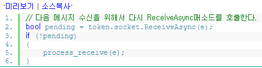

데이터를 한번 수신한 뒤에 ReceiveAsync를 다시 호출해줘야 합니다.
그래야 계속해서 데이터를 받을 수 있게 되죠. 한번의 ReceiveAsync로 모든 데이터를 다 받지는 못하기 때문입니다.
클라이언트가 잠시 쉬었다 보낼 수도 있고, 한번에 보낸것도 네트워크 환경에 따라서 여러번에 걸쳐 받을 수도 있거든요.
스트림 기반 프로토콜인 TCP의 특징입니다.

비동기 매소드를 호출한 뒤에는 항상 리턴값을 확인했었습니다. ReceiveAsync매소드도 동일합니다.
pending상태가 아니면 메시지 수신 처리를 진행할 수 있도록 직접 process_receive를 호출합니다.,
저는 여기서 한가지 의문이 들었는데요.
굉장히 자주 pending = false 상태가 된다면 Async->proceess_receive->Asny ...

이렇게 끊임없이 호출하다가 스택 오버플로우가 나진 않을까 하는 의문이었습니다. 
code project에 있는 어떤 외국사람이 만든 소스 코드를 봐도 위와 같은 구조로 되어 있더군요.
그곳 게시판에도 이런 의문을 가진 사람이 있었는데 자세히 읽어보진 못했습니다.
다른 설계를 사용하여 저런 무한 호출 구조를 회피한것 같더군요.

대부분의 경우에는 pending상태가 될것이기 때문에 별 문제 없겠지 라고 넘어가기엔 약간 개운하지 못하네요.

>> 네트워크 기반 코드 구현은 여기 까지 입니다.
C#에서 비동기 소켓 프로그래밍을 어떻게 구현하는지에 대한 부분이 주를 이루었는데
눈에 보이는게 없어서 다소 지루할 수 있는 부분이었던것 같습니다.
이론적으로 알고있던 부분이 C#에서 어떻게 코드로 표현되는지 이해하는 정도로 받아들이시면 될 것같습니다.
