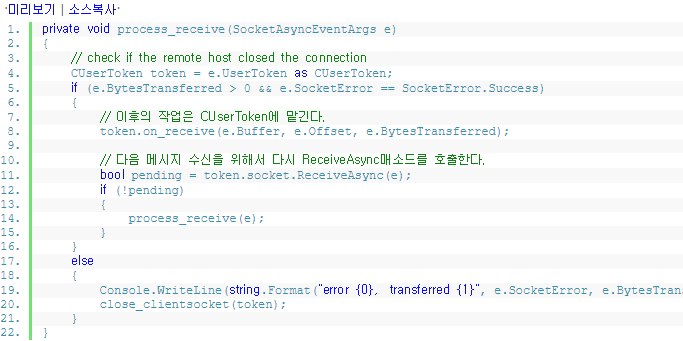
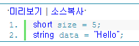
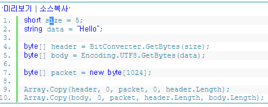
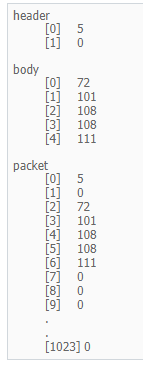
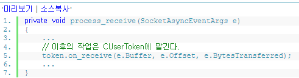
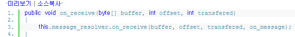

C#으로 게임 서버 만들기 - 3. TCP 패킷 수신 처리
============

### 메시지 경계 처리
tcp는 메시지의 경계가 없는 프로토콜입니다. 연속된 바이트들을 보내고 받을 뿐이죠.
경계가 없다는 것은 전송과 수신이 1:1로 이루어지지 않는다는 뜻입니다.
보내는 곳에서는 한번에 보내도 받는 곳에서는 두번에 걸쳐 받을 수 있다는 말이죠.

클라이언트가 "Hello" "World" 라는 문자열을 두번에 걸쳐서 서버로 보냈다고 합시다.
서버에서 수신할 떄는 아래의 모든 상황이 다 발생할 수 있습니다.

Hello
World
두번에 걸쳐서 받는 경우.

He
llo
World
He를 먼저 받고 그 다음에 llo, World를 받아 총 세번에 걸쳐서 받는 경우

한번에 받는 경우

소켓에서는 우리가 보낸 데이터가 어떤 의미를 갖는지 알 수 없습니다. 그것은 어플리케이션 내의 구현 영역인것이죠.
단지 바이트화된 데이터들을 네트워크 선로를 따라 목적지까지 보낼뿐입니다.
이 바이트들이 무엇을 의미하는지 소켓에서는 전혀 신경쓰지 않죠.
그렇다면 He+llo 이런식으로 데이터가 잘려서 올 경우, 또는 HelloWorld처럼 붙어서 올 경우에는 어떻게 HelloWorld 라는 문자열로 이쁘게 만들어 
낼 수 있을 까요?

소켓 버퍼로부터 데이터를 수신할 때 몇개의 부가정보를 파라미터로 받을 수 있다는 것을 ㅈ기억하시는지요??
이전 강좌에서 봤던 ReceiveAsync매소드의 콜백 처리 부분을 다시한번 보겠습니다.

token.on_receive(e.Buffer , e.Offset , e.BytesTransferred);
이 코드를 보면 CUserToken.on_receive 매소드를 호출하면서 세개의 파라미터를 전달하는 것을 알 수 있습니다.
각각 의미하는 내용은 아래와 같습니다.

e.Buffer
소켓으로부터 수신된 데이터가 들어있는 바이트 배열

e.Offset
데이터의 시작 위치를 나타내는 정수값

e.BytesTransferred
수신된 데이터의 바이트 수

콜백 매소드가 호출될 때 마다 새로운 데이터가 소켓 버퍼를 통해 들어오게 됩니다.
우리가 할일은 이 버퍼에 들어있는 데이터를 어플리케이션 버퍼로 복사하여 패킷이라는 의미있는 메시지로 만드는 것이다.
그러기 위해서는 데이터의 시작 위치를 가리키는 Offset과 수신된 데이터의 크기를 나타내는 BytesTransferred값을 이용해야 합니다.
이 정보들을 사용해서 하나의 데이터가 잘려서 오거나, 여러개의 데이터가 붙어서 올 경우에 대한 로직을 만들면 됩니다.

좀 더 단순하게 풀기 위해 소켓이란는 개념을 내려놓고 알고리즘 측면에서 접근해 봅시다.
제가 만든 "HelloWorld" 만들기 문제입니다.

1) HelloWorld라는 문자열이 있는데 이것을 Hello World 로 분리 시키기
2) He llo World를 Hello World로 만들기
3) Hel loWor ld 를 Hello World로 만들기

이제 각각의 경우에 대해서 로직을 세워보겠습니다.
1) Hello 는 다섯 글자 라는 것을 알 수 있으니 문자열의 첫  다섯 글자만 잘라서 하나를 만들고,
그 다음 다섯 글자를 잘라서 또 하나를 만들면 Hello, World로 분리 됩니다.

2) He는 아직 다섯 글자에 못미치니 다음 데이터를 붙여 봅니다.
He + llo = Hello 다섯 글자 하나가 완성되었네요
그 다음 World 도 다섯 글자이니 또 하나 완성

3) Hel은 아직 다섯 글자에 못미치니 다음 데이터를 붙여 봅니다.
Hel + loWor = 다섯글자가 넘어서 버리는 군요 이럴땐 다섯 글자 까지만 잘라서 하나를 만듭니다.
잘려진 나머지 데이터 Wor에 대해서 다시 다섯 글자를 만들어 봅시다.,
뒤에 ld를 붙이면 World가 완성됩니다.

이 문제에서 봤던 문자열을 소켓에서 넘어온 데이터라고 가정하면 됩니다.
물론 글자 크기에 맞게 자르고 붙이고 남은 데이터는 잠시 보관해 놓는 등의 작업이 귀찮긴 하지만
tcp 에서 패킷을 주고 받으려면 반드시 필요한 부분입니다.

###패킷 설계
앞에서 설명한 문제에서는 문자열이라고 말했는데 이제는 바이트라는 개념으로 바꿔서 생각하겠습니다.
사람이 보기에는 문자, 숫자이지만 컴퓨터로 표현되는 것은 그냥 바이트의 나열일 뿐입니다.
그리고 Hello가 다섯 글자라고 말했지만 이제부터는 5바이트 라고 생각하도록 합시다.
(유니코드 utf-8로 인코딩 했을 때 5바이트가 됩니다.)
여기서 잠시 이런 의문을 가져 봅시다.
Hello World는 각각 다섯글자 utf-8로 인코딩 하면 5바이트 라는 것을 우리는 눈으로 봐서 알 수 있습니다.
그래서 로직을 세울 때도 5바이트 만큼 잘라서 하나의 데이터를 완성하였죠
그런데 만약 Hello(5바이트) World(7바이트) 이렇게 데이터의 크기가 모두 다를 경우에는 어떻게 처리해야 할까요??

> 1) 패킷의 크기를 모두 고정시킨다.
> 2) 데이터 앞에 크기를 나타내는 값을 넣어서 같이 전송한다.
> 3) 데이터의 끝을 나타내는 특수 문자를 삽입한다.

tcp를 설명한 책에 보면 이렇게 세가지 예시가 나오더군요.
1번은 너무 제한적입니다. 게임에서 주고 받는 패킷의 크기가 모두 같을 순 없죠. 최대 크기로 만든다면 낭비도 심하고요.
3번은 효율이 안좋을 것 같습니다.,
바이트를 하나하나 비교해가며 데이터의 끝인지 아닌지 체크해야 하기 때문에 성능이 많이 떨어지겠네요.
또, 어떤 문자를 써야 하는지도 애매하고요.

2번이 기가 막힌 아이디어 같습니다. 데이터 앞에 크기를 써 넣고 그 크기 만큼만 뽑아서 하나의 패킷을 완성합니다.
다음 데이터도 마찬가지로 계속 반복하면 되겠죠.
그렇다면 2번 방법으로 로직을 세워봅시다.

앞에서 나왔던 Hello World문제를 약간 바꿔서 Hello World라고 바꿔보겠습니다.
그리고 각각의 데이터 앞에 데이터의 크기를 나타내는 값을 넣어봅시다.

> 5Hello , 7World

소켓으로 부터 데이터가 넘어오면 제일 처음 해야 할 일은 데이터 크기가 몇 바이트인지 알아내는 것입니다.
첫 부분을 보면 5라고 되어 있네요. 5바이트 만큼만 앞의 로직대로 처리하여 하나의 패킷을 만듭니다.
그 다음에는 7바이트 이므로 World를 만들어서 또 하나의 패킷을 완성합니다.

근데 너무 간단해 보여서 뭔가 허전하군요.
우리가 한가지 놓친것이 있습니다. 데이터 크기가 맨 앞에 붙어 있다는 것은 알았는데 이 크기를 나타내는 값은 도대체
몇 바이트 인것을 까요?
이제 간단하지만 아주 쓸모 있는 패킷 헤더를 설계해 볼 시간입니다.
헤더에는 이 데이터가 몇 바이트 인지 나타내주는 값이 들어가게 됩니다.

> [헤더][데이터][헤더][데이터]...

바로 이런 모습이 되도록 패킷을 만들어 볼 것입니다. [헤더]에는 데이터의 크기가 들어가는데 이 헤더의 바이트는 2
바이트로 고정하겠습니다.
데이터를 읽어올 때 처음 2바이트는 무조건 헤더라고 생각하면 됩니다.
그리고 헤더에 나타난 데이터 크기 만큼 읽어와서 하나의 패킷을 만들어 주면 되죠

그렇다면 Hello는 5바이트라는 것을 하나의 패킷으로 만들어 봅시다.

헤더를 2바이트로 고정한다고 말씀드렸기 떄문에 2바이트 자료형인 short를 사용했습니다.
이것의 의미는 우리가 보낼 데이터의 크기가 short자료형의 최대값을 넘지 않는다는 뜻입니다.
32767이기 때문에 게임에서 쓰기 충분할 것 같아서 결정했습니다. 더 큰 데이터를 보내고 싶으시면
short 대신 int를 사용하면 됩니다. 아니면 ushort를 사용해도 됩니다.

short 자료형으로 충분하고
unsigned 자료형이 없는 언어와 호환도 맞출 수 있습니다.

헤더와 데이터를 하나의 패킷으로 만드는 코드입니다.
BitConverter.GetBytes매소드는 데이터를 바이트 배열로 변환해주는 역할을 수행합니다.
short자료형으로 되어 있는 헤더를 바이트로 변환하여 byte header[] 배열에 채워 넣습니다.
다음으로 문자열 데이터도 바이트로 변환하여 넣는다 인코딩 방식은 utf-8을 사용했습니다.
그리고 byte[] packet = new byte[1024]; 라는 패킷 버퍼를 만들어서
[헤더][데이터] 의 구조로 패킷을 구성합니다.
array.Copy 매소드는 원본 배열 데이터를 다른 곳으로 복사할 때 사용하는 매소드 입니다.

여기 까지 하면 하나의 패킷이 완성된 것입니다.

header는 short자료형이므로 2바이트를 차지하며 내용은 5라는 정수값입니다.
body string을 바이트로 변환한 데이터이며 Hello 에 해당하는 유니코드 문자열 코드값이 들어가 있습니다.
utf-8로 인코딩 하였으므로 크기는 5바이트 만큼 차지합니다.
packet은 header와 body를 합쳐놓은 것이기 때문에 [header][data]가 차례대로 들어가게 됩니다.
뒤에 0으로 채워진 데이터는 비어있는 공간입니다.
실제로 원격지에 전송할 때는 이 빈 공간을 제외한 헤더 + 데이터의 크기 만큼만 소켓 버퍼로 전송해야 합니다.

###패킷 수신
tcp게임서버 구현시 패킷 처리하는 방법에 대해서 이론적으로 알아봤습니다.
이제 본격적으로 패킷 수신 코드를 작성해보겠습니다.
> 지금까지 단편적인 소스코드를 통해서 설명드렸기 떄문에 서버 라이브러리의 전체적인 모습은 잘 그려지지 않을 겁니다.
먼저 작은 부분들을 이해한 뒤 이런코드 조각들이 어떻게 조화를 이루게 되는지 설명드리도록 하겠습니다.
전체적인 설계는 프로그래머에 따라서 달라질 수 있기 때문에 처음부터 전체 모습을 보여드리면 혼란이 올 듯하여 소주제 위주로 설명해
나가겠습니다.

다시 process_receive 매소드로 돌아와 봅시다. token.on_receive 매소드로 넘기는 세개의 파라미터에 대해서는 위에서
이미 설명드렸습니다.
이제 저 파라미터를 사용하여 바이트 덩어리를 패킷이라는 의미있는 데이터로 만드는 방법에 대해서 알아보겠습니다.

CUserToken.on_receive 매소드의 내용 입니다.
매소드 안에서 message_resolver의 on_receive를 또 호출해 주고 있네요.
이것은 설계하는 사람에 따라 다를 수 있는 부분인데요, CUserToken클래스에서 직접 데이터를 해석하지 않고
message_resolver를 따로 둔 이유는 다음과 같습니다.
> 추후 확장성을 고려하여 다른 resolver를 만들 때 CUserToken의 코드 수정을 최소하 하기 위해서

강좌에서는 tcp메시지 경계 처리라는 목표에 집중하기 위해서 [헤더][데이터] 구조로 채택했지만
추후에 다른 방식으로 구성된 메시지를 사용하게 될 경우도 생길 수 있습니다.
따라서 데이터 해석은 message_resolver가 처리하고 CUserToken클래스는 유저객체 본연의 임무만 수행하도록 한 것입니다.

다음은 message_resolver의 on_receive매소드 입니다.

