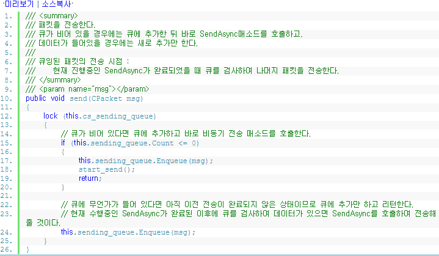

# 4. 데이터 전송

### 데이터 전송
#### 전송 큐 사용
sendAsync라는 비동기 전송 매소드를 사용하여 데이터 전송을 구현해보도록 하겠습니다.
데이터 수신에 비해 전송 구현은 간단한 편이지만 몇가지 주의할 점이 있습니다.
이 강좌에서는 하나의 전송이 완료된 후 다음 전송을 보내는 흐름으로 코드를 작성하도록 하겠습니다.
이런 방식을 1-send라고 호칭하는 경우도 봤는데 공식 용어는 아닌것 같습니다.

이 매소드는 CUserToken클래스에 포함되어 있습니다.
사실 어느 클래스에 들어 있는지는 크게 중요하지 않기 때문에 내용에만 집중하여 설명하겠습니다.
전송 로직은 다음과 같은 흐름으로 진행됩니다.

>1. 패킷을 만들어 전송큐에 추가합니다.
>2. 큐가 비어 있다면 즉시 비동기 전송 매소드를 호출합니다.
>3. 전송 오페레이션이 완료 된 후 다시 큐를 검사합니다.
>4. 데이터가 존재할 경우 비동기 전송 매소드를 호출합니다.
>5. 데이터가 없을 경우 더이상 아무런 작업을 하지 않고 리턴합니다.

원래 제가 알고 있던 데이터 전송 로직은 스레드를 이용하는 방법이였습니다.
큐에 추가하는 것 까지는 지금 강좌에서 설명드린 내용과 비슷하지만
큐에서 꺼내와 전송 매소드를 호출하는 부분이 별도의 스레드를 통해 구현되었던 것입니다.
스레드 하나에서 루프를 돌며 큐를 감시하다가 데이터를 하나씩 빼내어 전송하는 방식이죠.
하지만 가만히 생각해보니 스레드를 하나 더 사용하는것이 왠지 내키지 않았습니다.
스레드를 어디에 둬야 하는지 부터 명쾌하지 않았으며
과연 성능이 더 좋게 나올까 하는 의구심도 들었기 때문이죠
또한 스레드를 쓰면서 생기는 여러가지 복잡함도 제거해 버리고 싶었습니다.

그래서 이번 강좌에서는 다른 방식으로 생각해보기로 했습니다.
하나의 스레드에서 전송큐에 추가하고 닷넷 비동기 매소드인 SendAsync매소드까지 호출하는 방식입니다.
전송 요성시 바로 SendAsync매소드를 호출하지 말고 큐가 비었는지 확인 후 비었으면 큐에 추가 SendAsync호출 합니다.
비어있지 않다면 큐에 추가만 한 뒤 리턴합니다.
이 데이터는 앞서 큐에 추가된 데이터의 전송이 완료된 후 또 한번 큐를 체크하여 SendAsync매소드를 호출할 때 보내지게 될 것입니다.

만약 하나의 전송이 완료된 후 큐가 비어 있다면 새로 추가된 데이터가 없다는 뜻이므로 그냥 리턴 시킵니다. 그 이후에 또 다른 데이터가 큐에 추가된다면 위에 설명한 부분을 다시 반복하여 수행하도록 처리 합니다.

이 로직을 구현하고 간단히 테스트를 해봤는데 별다른 문제점을 발견하지 못했습니다.
하지만 정밀하게 테스트해본것은 아니기 때문에 더 좋다고 확신할 수는 없습니다.
일단 이 강좌에서는 이 방식으로 진행하도록 하겠습니다. 잘못된게 있으면 나중에 로직을 바꾸면 되니까요.
애써 코딩해 놓은것을 바꾸는 것에 대해 큰 부담감을 갖을 필요는 없습니다. 
언제든 코드를 바꿀 수 있다는 생각으로 코딩하면 중간 중간 어떠한 결정을 하는데 머뭇거림이 줄어들게 될겁니다.
물론 그렇다고 대충 설계하고 코딩하는건 안좋은 방법입니다. 고민은 많이 하되 판단은 빠르게 하는게 좋다고 생각 합니다.

### Socket.SendAsync
이제 닷넷의 비동기 매소드를 호출하는 부분을 살펴보겠습니다.

전송큐에 데이터를 넣은 뒤 호출되는 매소드 입니다.
일단 전송할 데이터 하나를 큐에서 가져옵니다. 여기서 주의할 부분은 Dequeue매소드를 사용하여 가져오지 말고
Peek매소드를 사용하여 큐에 데이터를 유지시켜 놔야 한다는 점입니다.
왜냐하면 아직 데이터 전송이 완료된것이 아니기 때문입니다.
앞에서 한번에 하나의 전송을 처리하고 그 전송이 완료된 이후에 다음 전송을 처리한다고 설명해 드렸습니다.
이 규칙을 깨지 않게 하려면 데이터 전송이 완료될 때 까지는 큐에 유지시켜 놔야 합니다.
만약 Dequeue 매소드를 사용하여 데이터를 꺼내오는것과 동시에 큐에서 제거 한다면 SendAsync매소드가 연속으로 호출될 가능성이 있습니다.
다음 과 같은 시나리오를 예상해 봅시다.

> 1. 전송 요청 -> 큐에 데이터 추가
> 2. 큐에서 데이터를 하나 꺼내온다 (Peek대신 Dequeue 사용)
> 3. Dequeue를 사용했으므로 큐는 empty 상태임
> 4. SendAsync 호출 -> 비동기 매소드이기 때문에 다른 스레드에서 전송 작업이 진행됨.
> 5. 또 다른 데이터를 전송 요청함.
> 6. 큐가 비어 있기 떄문에 즉시 start_send 매소드를 호출하여 그 안에서 SendAsync를 호출하게됨
> 7. 첫번째로 호출된 SendAsync가 아직 완료되지 않은 상태에서 또 SendAsync가 호출됨

바로 이런 시나리오가 가능할 수 있기 떄문에 위와 같이 큐를 통해서 흐름을 제어하게끔 구현한 것입니다.
그렇다면 SendAsync매소드가 이중으로 호출되면 안되는 이유라도 있는걸까요??
이부분은 저도 이론적으로 아직 완벽히 정립하지 못한 부분이지만 연구하면서 알게된 몇가지 사실들이 있습니다.

SendAsync매소드를 중복하여 호출하는 것 자체는 문제가 없습니다.
하지만 우리가 구현한 코드를 보면 SocketAsyncEventArgs를 SEndAsync매소드 호출시 파라미터로 넘겨주는 것을 볼 수 있습니다.

바로 이 부분입니다. this.send_event_args변수는 SocketAsyncEventArgs 타입의 변수인데,
비동기 전송 매소드를 호출할 때 매번 사용됩니다.
현재 진행중인 비동기 작업이 완료되지 않은 상태에서 이 변수를 재활용 하려고 하면 에러가 리턴됩니다.
무슨 에러인지는 잘 기억이 안나는데, 하여튼 아직 완료되지 않은 오퍼레이션이라서 안된다 뭐 그런 뜻이 었던것 같습니다.

앗 그렇다면 SoketAsyncEventArgs를 여러개 생성해놓고 사용하자! 라고 생각하는 분들도 있을 건데
저도 비슷한 생각을 해봤었는데, 도대체 몇개의 SocketAsyncEventArgs를 사용해야 할까요??
예상하기 힘드니 이것도 풀링하여 처리하면 될까요??
아니면 설정값을 정해놓고 그 한도 내에서만 처리할 수 있도록 구현해 볼까요??
이런 고민들 속에서 저는 한번에 하나의 전송을 처리하도록 하는 방법을 택한 것입니다.
SendAsync매소드를 동시 다발적으로 호출하게 될 경우 전송 순서가 꼬일 수 있지 않을까 하는 생각도 해봤습니다.
이럴 경우에는 애써 tcp서버를 구현해 놓고 전송 순서가 뒤죽박죽 되는 바보같은 경험을 하게 될지도 모르겠네요.
닷넷 내부에서 어떻게 구현해놨는지 까지는 파악하지 못했기 때문에 뭐라 확답을 드릴 수는 없습니다.
이런 상황에서는 최대한 안전하게 처리하는 방법이 좋겠죠??
의심되면 테스트 코드 만들어서 뻗을때 까지 뺑뺑이 돌리면 되니까요.!!!

###Socket.SendAsync완료처리
sendAsync매소드 역시 비동기 매소드 입니다. 지겹도록 들은 비동기 매소드 이번에도 역시 완료시 호출되는 콜백 매소드가 존재합니다.

코드의 주요 부분만 보면 이렇게 구현되어 있습니다.
앞서 설명한 코드를 보면 큐에서 데이터를 꺼내올 때 Peek를 사용하여 큐의 상태를 유지시켜 줬는데요,
여기서 Dequeue매소드를 사용하여 큐에서도 제거해 주도록 했습니다. 그리고 해당 패킷을 반환해주는 처리까지 들어갑니다.
CPacket클래스는 풀링하여 사용하게끔 처리해 놨기 때문에 반드시 반환 처리를 해줘야 메모리가 새지 않습니다.
마지막으로 큐에 데이터가 존재하는지 체크하여 계속 전송처리를 수행하도록 합니다. 데이터가 없다면 그냥 리턴하면 끝

Process_send매소드에서 처리해줘야 할 일은 몇가지 더 있습니다.
에러 코드도 확인해야 하고 일부만 전송했을 경우 나머지 데이터를 재전송 해주는등의 처리까지 구현해야 합니다.
재전송 처리를 꼭 해줘야 하는가에 대해서는 저도 잘 모르겠지만 다른 서버 커뮤니티에서 토론한 내용을 보면 발생할 수도 있는것 같더군요
이 강좌에서는 일단 흐름 위주로 진행하기 떄문에 세세한 부분은 건너뛰겠습니다.
(애매한 부분은 고수분들이 테스트해서 올려주면 좋을 것 같습니다.)

마지막으로 lock처리 한 부분에 대해서 설명하겠습니다.
제가 이번 강좌에서 언급한 내용중 한번에 하나의 전송을 처리하기 위해서
별도의 스레드를 사용하지 않고 구현하겠다고 말씀 드렸습니다.
그럼에도 불구하고 큐에 넣고 뺄 때 lock처리가 되어있습니다.
닷넷 비동기 소켓의 완료 처리시 호출되는 콜백매소드에서 이 큐를 참조하기 때문에 lock으로 감싸준 것입니다.
전송 요청을 할 때 큐에 추가하는 부분과 실제 SendAsync를 호출하는 코드는 동일한 스레드에서 이루어 집니다.

따라서 이 부분까지는 lock이 필요 없습니다.
하지만 SendAsync매소드의 완료 콜백 처리는 닷넷의 스레드풀에서 관리하는 스레드중 하나에서 호출됩니다.

> 전송요청 = A스레드 
> 완료 콜백 = B스레드

이렇게 두개의 스레드에서 동일한 큐에 접근하기 때문에 lock으로 감싸놓은 것입니다.
스레드를 안쓴다고 해놓고 lock을 써서 구현했으니 뭐 더 나아진건지 아닌지 모르겠네요..

비동기라 어쩔 수 없는것 같습니다.
완료 콜백 매소드인 process_send가 수행되는 중에 또다른 전송 요청이 이루어질 수 있으니깐요
